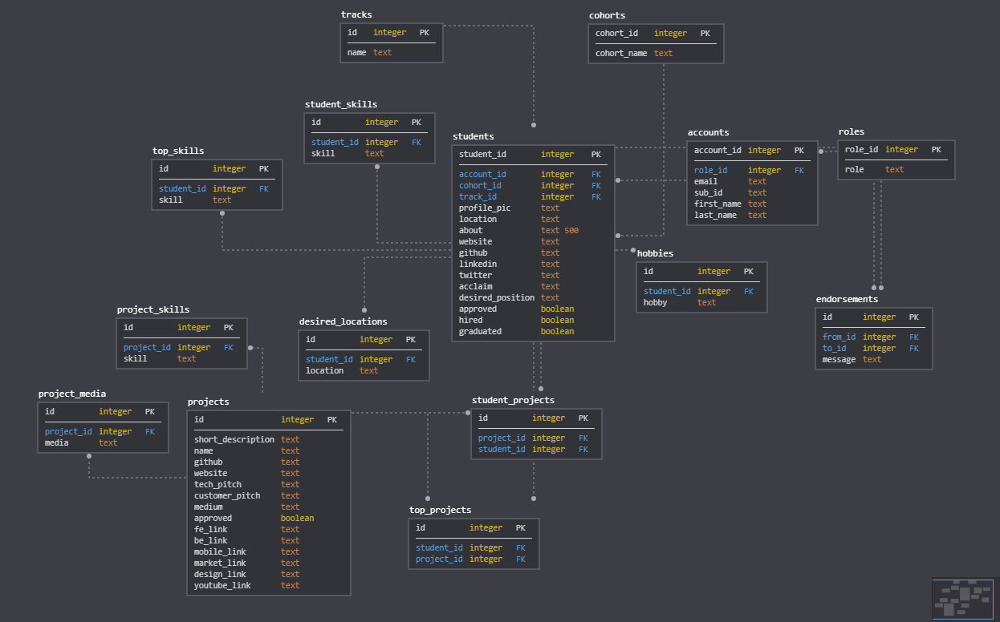

# Lambda Showcase

### Contributors:

|                                                      [Brandon Gardner](https://github.com/brandongardner2)                                                       |                                                      [Ryan Clark](https://github.com/ryangclark)                                                       |                                                    [Lowell Richardson](https://github.com/andrewlowell)                                                     |                                                    [Julian Moreno](https://github.com/julmo611)                                                    |                                                    [Jake Thomas](https://github.com/jmaxt12)                                                     |                                                [Tico Thep- sourinthone](https://github.com/ticotheps)                                                |
| :--------------------------------------------------------------------------------------------------------------------------------------------------------------: | :----------------------------------------------------------------------------------------------------------------------------------------------------: | :---------------------------------------------------------------------------------------------------------------------------------------------------------: | :------------------------------------------------------------------------------------------------------------------------------------------------: | :----------------------------------------------------------------------------------------------------------------------------------------------: | :--------------------------------------------------------------------------------------------------------------------------------------------------: |
|  |  |  |  |  |  |
|                                                                      |                                                                 |                                                                    |                                                               |                                                              |                                                                |
|                                 |                             |          |             |             |                            |

 
 

## Project Overview

Lambda Showcase is a capstone project built for Lambda School to create a central place for
prospective employers to discover Lambda School candidates and the projects they've built.

You can find the deployed project at https://lambdashowcase.netlify.com/.

### Key Features

* Candidates can create a personal profile to highlight their skills, interests, location, and other important details
* Students can create project breakdowns to showcase their work and expertise to prospective employers
* Employers can quickly and easily search profiles by skills, location, Lambda track, name, and more to discover candidates that match their needs
* Admins can mark candidates as approved for public viewing, hired, or graduated to keep profiles updated and the site curated with the best candidates
* Admins can add, update or delete tracks and cohorts so that students always have access to the most current school structure
* Admins can delete accounts as needed and also upgrade non-admin accounts to an admin role

---

## Tech Stack

### Frontend

#### Frontend Built using:
* React
* React Hooks
* Redux

#### Frontend deployed to Netlify

### Backend
[Repository Link](https://github.com/labs12-project-showcase/labs12-project-showcase-BE/)

#### Backend built using:
- Node.JS
- PostgreSQL
- Express
- Cloudinary

#### Data Model:

*Please see the files in the `migrations` [folder](https://github.com/labs12-project-showcase/labs12-project-showcase-BE/tree/master/data/migrations) in the backend repository for more details.*

#### Backend deployed to Heroku

---

## APIs

### Authentication — *Auth0*

All accounts use [Auth0](https://auth0.com) for authentication.
* **Candidate** accounts use GitHub as their Identity Provider. All students learning programming should have already have a GitHub account – that will need to be expanded as candidates grow into other industries – and the site can pre-populate a candidate's profile with GitHub data.
* **Admin** accounts use email/password to authenticate through Auth0.

### Geocoding & Maps — *Mapbox*
The site uses [Mapbox](https://www.mapbox.com/) for all its location needs.
* Users can search for locations – either to set their current location or to search for candidates near a location – using the Mapbox [Forward Geocoding](https://docs.mapbox.com/api/search/#forward-geocoding) API. The latitude and longitude for the searched point can be used to calculate distances between locations.
* Distances between points are calculated using PostgreSQL's [earthdistance](https://www.postgresql.org/docs/current/earthdistance.html) module as part of database queries.
* The landing page uses [react-map-gl](https://uber.github.io/react-map-gl/#/), which is Uber's library for creating Mapbox maps in React applications, to display candidate locations.

---

## Environment Variables

In order for the app to function correctly, the user must set up their own
environment variables. 

#### Frontend Environment Variables
The frontend folder should contain a `.env` file with the following:  

| Variable                 | Comment                                  |
| :----------------------- | :--------------------------------------- |
| `REACT_APP_MAPBOX_TOKEN` | Mapbox token for use with `react-map-gl` |

#### Backend Environment Variables
The backend folder should contain a `.env` file with the following:  

| Variable                 | Comment                                                        |
| ------------------------ | -------------------------------------------------------------- |
| `CLOUD_API_KEY`          | Cloudinary API key                                             |
| `CLOUD_API_SECRET`       | Cloudinary secret key                                          |
| `CLOUD_NAME`             | Cloudinary account name                                        |
| `DATABASE_URL`           | URL of PostgreSQL database                                     |
| `DB_ENV`                 | Environment variable for database; should like be `production` |
| `INITIAL_ADMIN_EMAIL`    | Email address of the first admin account                       |
| `INITIAL_ADMIN_PASSWORD` | Password for first admin account                               |
| `JWT_SECRET`             | Used to create JSON Web Tokens                                 |
| `OAUTH_CLIENT_ID`        | Auth0 Client ID                                                |
| `OAUTH_CLIENT_SECRET`    | Auth0 Client Secret                                            |
| `OAUTH_MGR_API`          | Auth0 URL for Manager API                                      |
| `OAUTH_TOKEN_API`        | Auth0 URL for Token API                                        |
| `SENDGRID_API_KEY`       | Sendgrid API key                                               |

## Contributing

### Issue/Bug Request

If you are having an issue with the existing project code, please submit a bug report under the following guidelines:
* Please check to see if your issue has already been reported.
* Check to see if the issue has recently been fixed by attempting to reproduce the issue using the latest master branch in the repository.
* Create a live example of the problem. Online code editors like [codesandbox](https://codesandbox.io/) and [codepen](http://codepen.io/) are ideal for this step.
* Submit a detailed bug report including your environment & browser, steps to reproduce the issue, actual and expected outcomes, where you believe the issue is originating from, and any potential solutions you have considered.

### Feature Requests

We would love to hear from you about new features that would improve the app
and further the aims of our project. Please provide as much detail as possible to
make your case as to why the feature should be implemented.

### Pull Requests

If you have developed a patch, bug fix, or new feature that would improve this
app, please submit a pull request. We recommend communicating with the
developers before investing a great deal of time into a pull request to
ensure that your work will integrate smoothly into the project.

Remember that this project is licensed under the MIT license, and by submitting
a pull request, you agree that your work will be, too.

#### Pull Request Guidelines

  * Ensure any install or build dependencies are removed before the end of the layer when doing a build.
  * Update the `README.md` with details of changes to the interface, including new environment variables, exposed ports, useful file locations and container parameters.
  * Ensure that your code conforms to our existing code conventions and test coverage.
  * Include the relevant issue number, if applicable.
